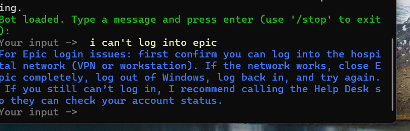

# 🏥 Epic Clinical Support AI Assistant (Rasa)

A conversational AI assistant built with Rasa to help clinicians and healthcare staff troubleshoot common Epic EHR issues such as login failures, password resets, and charting problems — without accessing patient data.

## What Problem This Solves

Healthcare IT teams receive large volumes of repetitive Epic-related tickets that delay care and overwhelm support staff.

This assistant provides immediate first-line troubleshooting, reducing downtime and unnecessary helpdesk tickets.

## What This Assistant Does

- Troubleshoots common Epic issues (login, password, orders, notes, printing)
- Asks clarifying questions instead of guessing
- Uses fallback handling for out-of-scope requests
- Avoids PHI and does not access Epic systems

## Example Issues Supported

- Epic login and access problems  
- Password reset issues  
- Orders not signing  
- Notes not saving  
- In Basket messaging issues  
- Barcode scanning and printing issues  

## Future Enhancements

- Microsoft Teams integration via Rasa REST API to provide in-workflow clinician support.

- ## Frequently Asked Questions

### Where can I find lab results for a patient?
Lab results are found in **Results Review** or the **Labs** activity within the patient chart.

### Where do I document on the patient?
Patient documentation is completed in **Flowsheets**, where assessments and required charting are entered.

### Where can I find old notes on the patient?
Old notes are located in **Chart Review** under the **Notes** section.

### Where do I find the patient’s demographic information?
Patient demographics are available in the **Demographics** section or **Patient Header**.

### Where do I document that I gave medications?
Medication administration is documented in the **MAR (Medication Administration Record)**.

### Where can I see all my patients at one glance, including room numbers?
All assigned patients can be viewed in the **Patient List** or **Unit Manager**.

### Where do I chart vitals on the patient?
Vitals are charted in the **Vitals section of the Flowsheets**.

### Where do I document intake and output?
Intake and output are documented in the **I&O Flowsheet**.

### Where do I chart patient assessments?
Patient assessments are documented in the appropriate **Assessment Flowsheets**.

### How do I add an addendum to a note?
Open the original note and select **Add Addendum**.

### Why can’t I see my orders?
Orders may be filtered, pending, discontinued, or tied to a different encounter.

### How do I see discontinued or completed orders?
Use filters in **Orders** or **Chart Review** to view inactive orders.

### Why is a medication showing as overdue?
Medications may appear overdue due to timing windows or missing documentation in the MAR.

### What do I do if a medication won’t scan?
Verify the barcode and patient band, then follow unit policy if scanning fails.

### How do I add or remove patients from my patient list?
Patients can be managed through **Patient List Management**, depending on role permissions.

### Why is my patient not showing on my list?
The patient may be assigned elsewhere, discharged, or off the unit. If physically present but missing in **Unit Manager**, place the patient back in bed from the **Incoming Transfer** list.

### How do I switch departments or units?
Change your **context** using the department or unit selector.

### Why does Epic say my account is locked?
Accounts may lock after multiple failed login attempts or if required Epic training has not been completed. Assistance from a hospital training educator or the Help Desk is required.

### What should I do if Epic freezes or stops responding?
Restart Epic or log out and back in. Contact IT if the issue continues.

### Who do I contact if I’m having access issues?
Contact the **Help Desk** or local IT support.

### When should I contact the Help Desk?
Contact the Help Desk for access issues, system errors, or unresolved problems.

### What information should I provide when calling support?
Provide your role, department, workstation, physical location, contact information, and a brief description of the issue.

### Where do I see allergies for a patient?
Allergies are found in the **Allergies section** or **Chart Review**.

### Why can’t I sign my note?
Notes may be locked, incomplete, or tied to the wrong encounter context.

### Why is my order pended?
Orders may require provider signature or additional information.

### If I place an order and it doesn’t pull up, what should I do?
Check filters, spelling, order sets, and the **Facility List** or **Database** tab. Inpatient orders show a **bed icon**, ambulatory orders show a **house icon**.

### How do I know if a lab has been collected?
Lab collection status can be found in **Chart Review** under **Labs**. Scroll to the right to view the **Status** column, or check **Order Details** or **Results Review**.

### Where do I see imaging results?
Imaging results are available in **Results Review** or **Chart Review**.

### How do I talk to pharmacy from Epic?
Use the **Pharmacy RX** button in the **MAR** on the far right of the medication row.

### Where do I document education?
Patient education is documented in the **Education tab**, usually as part of the shift checklist.

### Where do I document codes and rapid responses?
Code documentation is completed in the **Code tab**, where **Code Narrator** can be pinned.

### Why can’t I discharge my patient?
Discharge may be blocked by incomplete documentation, orders, or discharge criteria.

